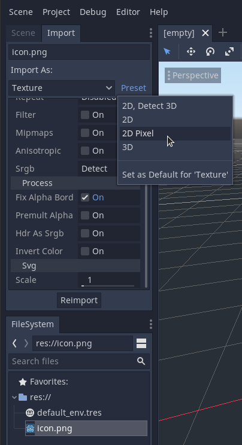

# Godot 2D Quick Reference Guide

Based on [HeartBeast's Godot Action RPG Series](
https://youtube.com/playlist?list=PL9FzW-m48fn2SlrW0KoLT4n5egNdX-W9a)

## Create a New Project

Open up Godot. Click **New Project**. Name your project. Click **Create Folder** and then **Create & Edit**.

## Set Texture Defaults

Click an image like the default icon.png. Select the **Import** tab. Click **Preset** then **2D Pixel** then **Reimport**. Select **Preset** then **Set as Default for 'Texture'**.

## Create a Scene

Click the **Scene** tab. Under **Create Root Node** select **2D Scene**. Save the scene (Ctrl + s) and name it.

## Set 2D Project Settings

In Project Settings > General > Display > Window:
* Set **Width** to 320 and **Height** to 180
* Set **Test Width** and **Test Height** to 1280 and 720
* Under **Stretch**, set **Mode** to 2d.

